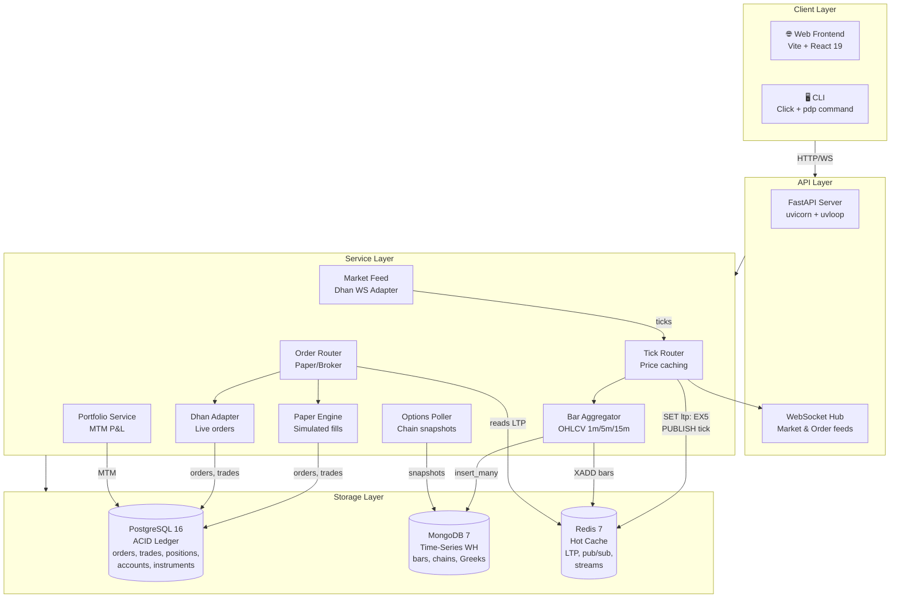
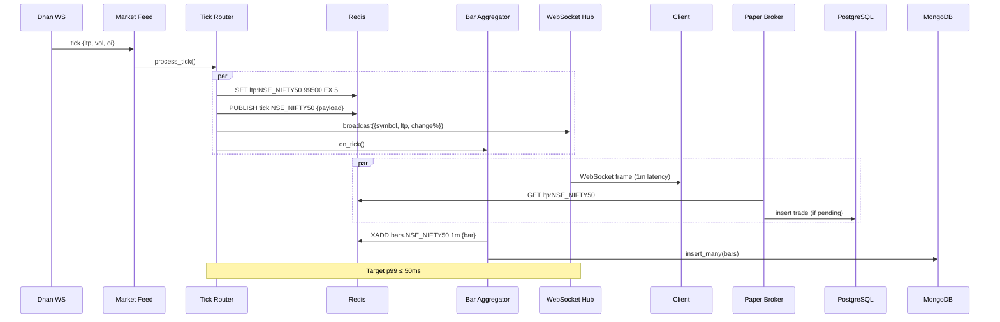
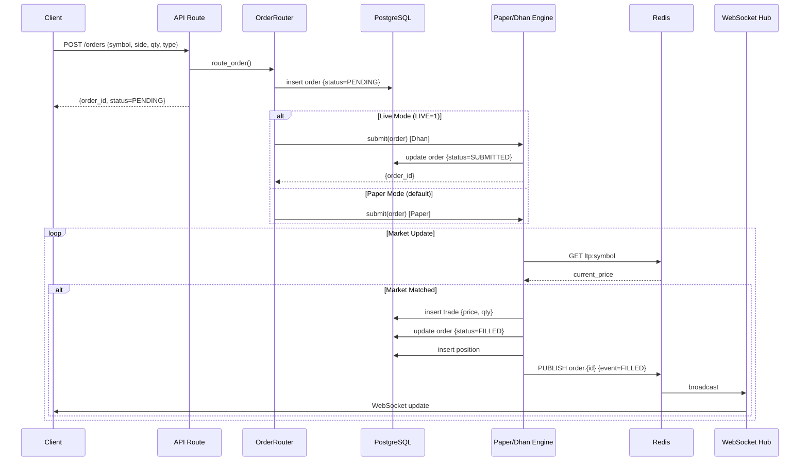
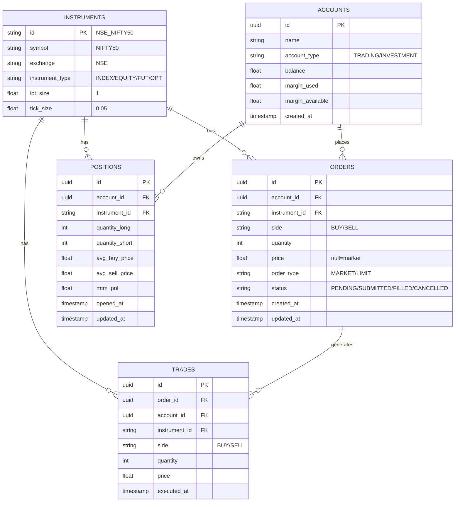
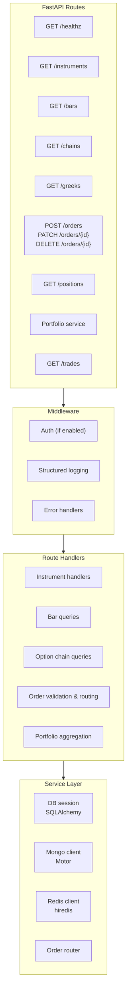
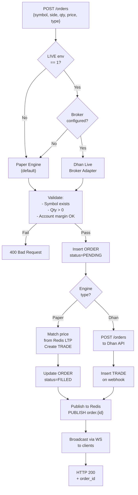
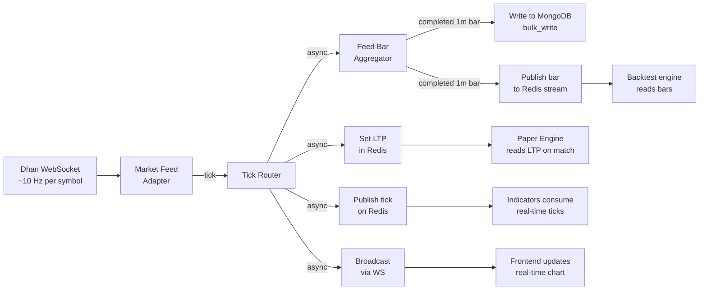
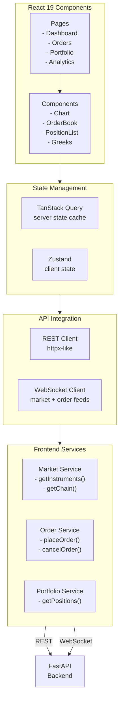
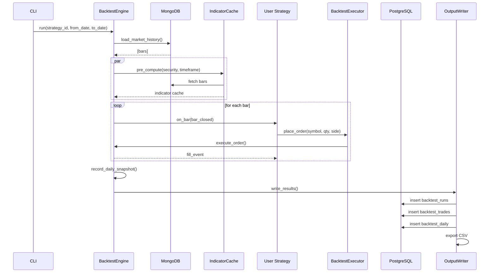

# PDP — Architecture

This document describes the system architecture, data flow, and component interactions.

---

## System Overview

PDP is a **three-tier architecture** with clear separation of concerns:



---

## Data Flow: Market Tick → WebSocket Broadcast

The **hot path** where latency matters most (p99 ≤ 50ms):



---

## Order Execution Flow



---

## Database Schema (Conceptual)



---

## PostgreSQL — ACID Transactional Ledger

**Primary responsibility:** Immutable record of all trades, orders, positions, accounts.

```
PostgreSQL (ACID, normalized, indexed)
├── instruments          # NSE/BSE/MCX symbols + metadata
├── accounts             # Trading accounts
├── orders               # All order submissions (immutable)
├── trades               # Executed trades (immutable)
├── positions            # Current holdings (mutable aggregates)
├── corporate_actions    # Splits, dividends, etc.
└── indices              # Query acceleration (symbol, created_at, status)

Guarantees:
- Row-level ACID isolation (serializable transactions)
- Foreign key integrity
- Full trade audit trail
```

---

## MongoDB — Time-Series Data Warehouse

**Primary responsibility:** Fast sequential scan for bars, chains, Greeks, analytics.

```
MongoDB (denormalized, time-series optimized)
├── market_bars
│   └── {
│         _id: ObjectId,
│         symbol: "NSE_NIFTY50",
│         timeframe: "1m",
│         open: 99500,
│         high: 99600,
│         low: 99400,
│         close: 99550,
│         volume: 1000000,
│         timestamp: ISODate,
│         indicators: {
│           sma_20: 99450,
│           sma_50: 99300,
│           rsi_14: 65.3
│         }
│       }
├── option_chains
│   └── {
│         _id: ObjectId,
│         symbol: "BANKNIFTY",
│         expiry: "2026-06-25",
│         timestamp: ISODate,
│         strikes: [
│           {
│             strike: 43000,
│             ce: {ltp: 150, iv: 22.5, delta: 0.65, gamma: 0.01},
│             pe: {ltp: 80, iv: 20.1, delta: -0.35, gamma: 0.01}
│           },
│           ...
│         ]
│       }
└── snapshots         # Current indicator state (for backtest)
    └── {symbol, timeframe, indicators, timestamp}

Performance:
- Automatic TTL (expire old bars after 1 year)
- Compound index on (symbol, expiry, timestamp)
- Bulk insert on bar write (1000s/sec)
```

---

## Redis — Hot Cache & Pub/Sub

**Primary responsibility:** Sub-millisecond LTP lookups, real-time pub/sub, bar streams.

```
Redis (in-memory, volatile)
├── Strings (expires in 5s)
│   ├── ltp:NSE_NIFTY50 → "99550"
│   ├── ltp:NSE_BANKNIFTY → "43250"
│   └── ...
├── Pub/Sub Channels
│   ├── tick.NSE_NIFTY50          # broadcasted on every tick
│   ├── tick.NSE_BANKNIFTY        # ~10Hz per symbol
│   ├── order.{order_id}          # order status changes
│   └── trade.{symbol}            # matched trades
├── Streams
│   ├── bars.NSE_NIFTY50.1m       # {o, h, l, c, v, t}
│   ├── bars.NSE_NIFTY50.5m
│   ├── bars.NSE_BANKNIFTY.1m
│   └── ...
└── Hash Maps
    ├── position:{account_id} → {qty, cost, mtm}
    └── balance:{account_id} → {cash, margin, used}

Latency: < 1ms p99
Retention: 24h (automatic expiry)
```

---

## API Layer Structure



**Principles:**
- One mutation per route (no kitchen-sink endpoints)
- All database access via ORM (SQLAlchemy) or async drivers
- Async/await throughout (no blocking calls)
- Structured logging with context (correlate logs across calls)

---

## Order Routing Decision Tree



---

## Market Data Pipeline



---

## Frontend Architecture



---

## Broker Integration: Dhan

```mermaid
graph TB
    subgraph PDP["PDP"]
        OrderAPI["Order API<br/>POST /orders"]
        OrderRouter["Order Router"]
        DhanAdapter["Dhan Adapter<br/>src/pdp/orders/broker.py"]
        DhanSDK["dhanhq SDK"]
    end

    subgraph Dhan["Dhan Broker"]
        DhanAPI["REST API<br/>/orders"]
        DhanWS["WebSocket Feed<br/>market data + fills"]
    end

    subgraph PG["PostgreSQL"]
        Orders["orders table"]
        Trades["trades table"]
    end

    OrderAPI -->|order| OrderRouter
    OrderRouter -->|LIVE=1| DhanAdapter
    DhanAdapter -->|placeOrder()| DhanSDK
    DhanSDK -->|POST| DhanAPI
    DhanAPI -->|200 OK| DhanSDK
    DhanSDK -->|callback| DhanAdapter
    DhanAdapter -->|insert trade| Orders
    DhanAdapter -->|insert trade| Trades
    DhanWS -->|ticks| DhanAdapter

    Note over DhanAdapter: Paper mode bypasses Dhan<br/>Uses Redis LTP instead
```

**Paper vs. Live:**
- **Paper (default):** Orders matched against Redis LTP immediately
- **Live (LIVE=1):** Orders submitted to Dhan, fills arrive via webhook/WS

---

## Asynchronous Processing

All I/O in PDP is non-blocking via `asyncio`:

```mermaid
graph TB
    FastAPI["FastAPI<br/>uvicorn + uvloop<br/>10k concurrent reqs"]
    --> Deps["Dependency Injection<br/>Session, clients"]

    Deps --> Routes["Route handlers<br/>async def"]

    Routes -->|await db.execute| SQLORM["SQLAlchemy<br/>async engine"]
    Routes -->|await motor.db| MongoDriver["Motor<br/>async Mongo"]
    Routes -->|await redis| RedisDriver["aioredis<br/>async Redis"]
    Routes -->|await httpx| HTTPClient["httpx<br/>async HTTP"]

    SQLORM --> PG["PostgreSQL"]
    MongoDriver --> Mongo["MongoDB"]
    RedisDriver --> Redis["Redis"]
    HTTPClient --> Dhan["Dhan API"]

    Note over FastAPI: Zero blocking calls<br/>on hot path
```

---

## Error Handling & Observability

```mermaid
graph TB
    Request["Request"] --> Handler["Handler"]
    Handler -->|try| Logic["Business Logic"]
    Logic -->|except| Handler
    Handler -->|response| structlog["structlog"]
    structlog -->|JSON stdout| Logs["Structured Logs<br/>{timestamp, level,<br/>module, msg, context}"]
    
    Logs -->|ELK / CloudWatch| Monitoring["Monitoring<br/>- Error rates<br/>- Latency percentiles<br/>- Trade volume"]

    Handler -->|✅ 200| Client
    Handler -->|⚠️ 400| Client["Client<br/>{error_code,<br/>message}"]
    Handler -->|❌ 500| Client

    Note over Handler: All errors logged with<br/>full context (user, account, trade)
```

---

## Deployment Architecture (Future)

`backend/Dockerfile` (multi-stage `uv` build) plus the `api`/`engine`/`ops` services in
`infra/compose/docker-compose.yml` (behind the `app` profile — `task docker:up`, see
`docs/RUNBOOK.md` §3) are the local single-host precursor to this: one image, three roles
selected by `PDP_ROLE`, already split apart per `openspec/specs/api-worker-decoupling/`.
The diagram below is the AWS-hosted, horizontally-scaled version of the same split
(load-balanced API pods + worker pods against managed RDS/DocumentDB/ElastiCache).

```mermaid
graph TB
    subgraph Cloud["Cloud (e.g., AWS)"]
        LB["Load Balancer<br/>→ :8000"]
        API1["API Pod 1<br/>uvicorn"]
        API2["API Pod 2<br/>uvicorn"]
        API3["API Pod 3<br/>uvicorn"]
        Worker["Worker Pods<br/>- BarWriter<br/>- OptPoller<br/>- PortfolioMTM"]
    end

    subgraph Data["Data Layer"]
        RDS["AWS RDS<br/>PostgreSQL 16"]
        DocumentDB["AWS DocumentDB<br/>(MongoDB compat)"]
        ElastiCache["AWS ElastiCache<br/>Redis 7"]
    end

    subgraph External["External"]
        Dhan["Dhan Broker<br/>WebSocket"]
    end

    LB --> API1
    LB --> API2
    LB --> API3
    API1 --> RDS
    API1 --> DocumentDB
    API1 --> ElastiCache
    Worker --> RDS
    Worker --> DocumentDB
    Worker --> ElastiCache
    API1 --> Dhan
    Worker --> Dhan

    Note over Cloud: Horizontal scale<br/>stateless API pods
```

---

## Key Constraints & Trade-offs

| Constraint | Why | Implication |
|-----------|-----|-------------|
| **Paper-first** | Avoid accidental live trades | `LIVE=1` required for live mode |
| **Spec-first** | Design clarity before code | All features in `openspec/changes/` |
| **One mutation per route** | Testability, clarity | No kitchen-sink endpoints |
| **DB separation** | ACID vs. analytics trade-off | Cross-DB queries via app layer |
| **Latency p99 ≤ 50ms** | Real-time trading requires speed | No blocking calls on hot path |
| **Redis 5s TTL on LTP** | Memory efficiency | Stale price if broker offline |
| **Structured logging only** | Operational observability | No `print()` in core modules |
| **Async everywhere** | Concurrency without threads | Requires async/await throughout |

---

## Scalability Notes

**Current capacity (single instance):**
- API: 1,000 req/s (uvloop + httptools)
- Tick throughput: 10,000/s per symbol
- Market bars: 1,000,000/day
- PostgreSQL: 100M orders (with indexing)

**Horizontal scaling:**
- API pods: stateless, scale behind LB
- Workers: independent (bar writer, options poller, MTM)
- Redis: single instance (24h retention is fine for cache)
- PostgreSQL: read replicas for analytics
- MongoDB: sharded by symbol for analytics

---

## Backtest Engine

The **backtest engine** replays historical market data through strategies using the same event-driven interface as live trading:



**Key Components:**

1. **BacktestEngine** — Orchestrates bar replay, manages positions, tracks P&L
2. **SimulatedClock** — Context var that makes `datetime.now()` return bar timestamp
3. **IndicatorCache** — Pre-computes Polars-vectorized indicators (SMA, EMA, RSI) once per (security, timeframe)
4. **BacktestExecutor** — Simulates market order fills at bar close, validates position limits
5. **BacktestOutputWriter** — Persists run metadata, trades, and daily snapshots; exports CSV

**Data Flow:**
- Fetch historical bars from MongoDB `market_bars` collection
- Pre-compute indicators for entire date range (one-time, cached)
- Process bars chronologically, dispatching `on_bar()` hooks
- Simulate order execution at bar close (OHLC)
- Accumulate trade log and daily equity snapshots
- Write to PostgreSQL (`backtest_runs`, `backtest_trades`, `backtest_daily`)
- Export CSV for analysis

**Constraints:**
- Orders fill immediately at bar close; no intrabar execution
- No slippage or partial fills (conservative baseline)
- Single-threaded replay (no parallelization yet)

---

## See Also

- [openspec/project.md](openspec/project.md) — Tech stack, conventions, glossary
- [README.md](README.md) — Setup, quickstart, APIs
- [CLAUDE.md](CLAUDE.md) — Spec-first workflow
