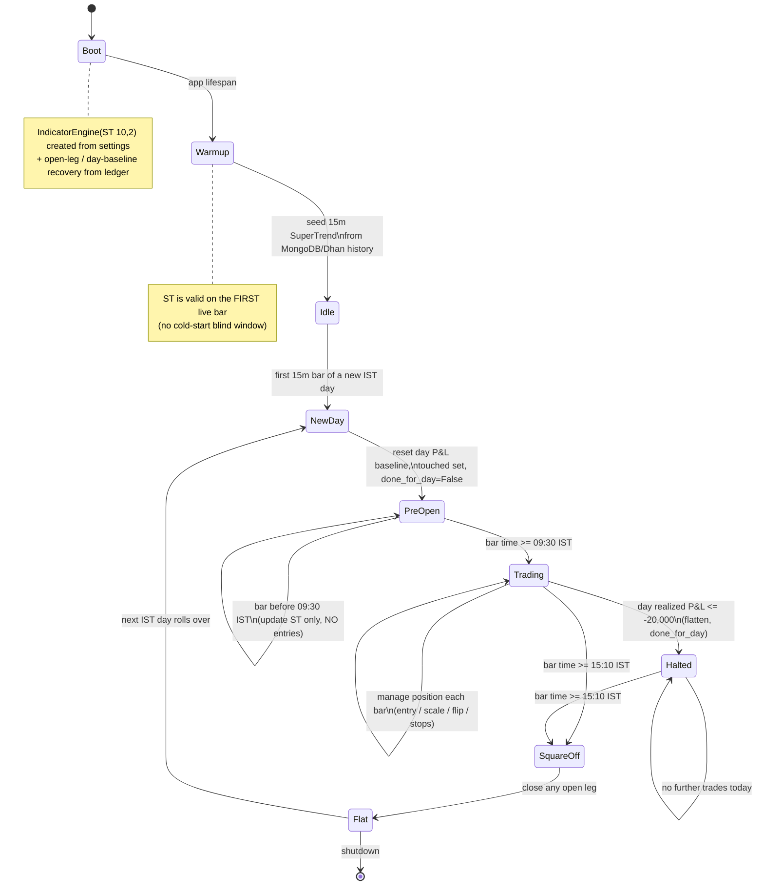

# SuperTrend(10,2) Short — Strategy Flow

NIFTY intraday option-selling, **paper-only**. On each closed **15-minute** NIFTY bar the
universal `IndicatorEngine` computes `SuperTrend(period=10, multiplier=2)`; the strategy sells an
OTM-1 option aligned with the trend and manages it until a flip, a stop, or square-off.

- **Green (uptrend) → short OTM-1 PE** · **Red (downtrend) → short OTM-1 CE**
- Entry size `start_lots=2`, scale `+1` lot per bar while the trend holds, cap `max_lots=5`
- Per-leg stop `3,000 × lots` · day stop `−20,000` realized · square-off `15:10 IST`
- Config: `strategies/supertrend_short.yaml` (params) + `SUPERTREND_PERIOD/MULTIPLIER` (settings)

> Promoted 2026-06-14 from ST(3,1)/5m to ST(10,2)/15m after the parameter sweep
> (ST(10,2) 15m OTM1 = PF 4.12 / +277k over 83 days vs ST(3,1) 5m = PF 0.48 / −292k).

---

## 1. Session & day lifecycle

How a trading day is framed: SuperTrend is warmed from history at boot, daily accumulators reset
on the first bar of each IST day, entries are only allowed inside the window, and everything is
flattened at square-off.



---

## 2. Per-bar decision flow (entry & exit)

Every closed 15-minute NIFTY bar walks this ladder top-to-bottom; the **first** matching branch
acts and the bar ends. Hard exits (square-off, day-stop, leg-stop) are checked **before** any new
trading decision, so risk always wins ties.

```mermaid
flowchart TD
    Bar([Closed 15m NIFTY bar]) --> Dedup{Right security & 15m?\nNot a duplicate bar?}
    Dedup -- no --> Ignore[ignore]
    Dedup -- yes --> Reset[reset day accumulators\nif new IST day]

    Reset --> SQ{time >= 15:10 IST?}
    SQ -- yes --> CloseSQ[[EXIT: close open leg -> square_off]] --> DoneFlag[done_for_day = true] --> End([wait next bar])
    SQ -- no --> Done{done_for_day?}
    Done -- yes --> End

    Done -- no --> ST{SuperTrend ready?\ndirection is set?}
    ST -- no --> End
    ST -- yes --> Win{time >= 09:30 IST?\n(trading window open)}
    Win -- no --> End

    Win -- yes --> Sync[sync lots from positions table\n(flat -> drop stale leg)]
    Sync --> DayStop{day realized P&L <= -20,000?}
    DayStop -- yes --> CloseDay[[EXIT: close open leg -> day_stop]] --> DoneFlag
    DayStop -- no --> LegStop{open leg MTM loss >= 3,000 x lots?\n(fresh option LTP only)}
    LegStop -- yes --> CloseLeg[[EXIT: close open leg -> leg_stop]] --> End

    LegStop -- no --> Desired[desired = ST up ? PE : CE]
    Desired --> HasPos{open leg?}

    HasPos -- no --> Entry[[ENTRY: SELL OTM-1 of desired side\n@ start_lots = 2]] --> End

    HasPos -- yes --> Aligned{open leg side == desired?}
    Aligned -- no --> Flip[[EXIT+ENTRY: close leg -> flip,\nthen SELL opposite OTM-1 @ 2 lots]] --> End
    Aligned -- yes --> Cap{lots < max_lots = 5?}
    Cap -- yes --> Scale[SCALE-IN: SELL +1 lot of same leg] --> End
    Cap -- no --> Hold[hold at max lots] --> End
```

### Entry
- **Trigger:** a closed 15m bar inside `09:30–15:10 IST` with a valid SuperTrend direction and **no
  open leg**.
- **Action:** SELL the OTM-1 option aligned with the trend — short **PE** when SuperTrend is green
  (up), short **CE** when red (down) — at `start_lots = 2`.
- **Scale-in:** while the leg stays trend-aligned and below `max_lots = 5`, add `+1` lot each
  subsequent bar (premium income compounds as the trend persists).

### Exit (four ways out, in priority order)
1. **Square-off** — at/after `15:10 IST` the open leg is bought back and the day ends. Highest priority.
2. **Day stop** — once today's *realized* P&L hits `−20,000`, flatten and stop trading for the day.
3. **Leg stop** — if the open leg's unrealized MTM loss reaches `3,000 × current lots` (marked
   against the option's own fresh Redis LTP; skipped if the LTP is stale), close the leg. No new
   entry on the stop bar — the next bar's signal decides.
4. **Flip** — when SuperTrend reverses, buy back the current leg (`flip`) and open the opposite
   side fresh at `start_lots`. If the cover hasn't fully filled yet, the re-entry is deferred to a
   later bar.

---

## Configuration surface

| Knob | Where | Current |
|------|-------|---------|
| SuperTrend period / multiplier | `settings.SUPERTREND_PERIOD` / `SUPERTREND_MULTIPLIER` | 10 / 2.0 |
| Signal timeframe | `supertrend_short.yaml` → `params.timeframe` + `watchlist.timeframes` | 15m |
| Moneyness (OTM steps) | `params.otm_steps` (+ `strike_step`) | 1 (×50) |
| Sizing | `params.start_lots` / `add_lots` / `max_lots` (× `lot_size`) | 2 / 1 / 5 (×65) |
| Session window | `params.start_ist` / `square_off_ist` | 09:30 / 15:10 |
| Per-leg stop | `params.leg_stop_per_lot` | 3,000 / lot |
| Day stop | `params.day_stop` | 20,000 |

> The live strategy uses **simple flip (close + reverse)** and **scale-every-bar**. The richer
> backtest semantics (flip→strangle, premium-break scale-in gate, roll-up) live only in the
> backtest engine (`pdp.backtest.sim`); the sweep showed they did **not** improve on the simple
> logic at these params, so they were intentionally not ported to paper.
