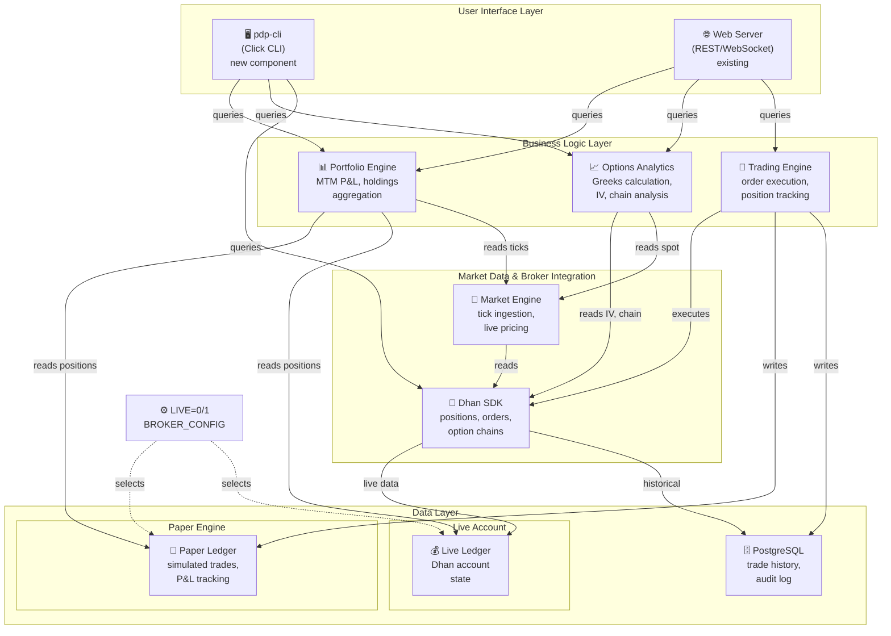
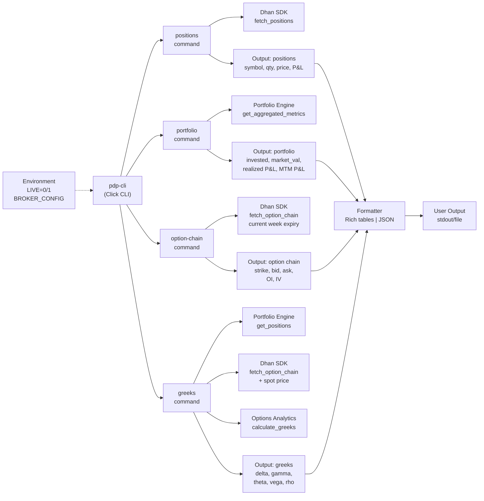

## Context

The PDP project has implemented Dhan broker integration, portfolio P&L tracking, and options analytics (Greeks calculation). We need a CLI tool to validate these components work together correctly during development and manual testing. Currently there's no easy way to debug broker connectivity or verify position state without standing up the full web server.

## Goals / Non-Goals

**Goals:**
- Provide a quick CLI entrypoint to test Dhan broker connectivity
- Display current positions from the Dhan account
- Display portfolio summary (holdings, MTM P&L, etc.)
- Fetch and display current week option chain with computed Greeks
- Calculate and display Greeks for all open positions
- Enable developers to debug integration without UI

**Non-Goals:**
- Real-time monitoring or alerting (one-shot commands only)
- GUI or interactive shell
- Persistence of results
- Broadcasting results to WebSocket (that's the server's job)

## Decisions

**1. Architecture: Reuse existing engines and SDK**
   - Use the Dhan SDK directly (no new abstraction layer)
   - Leverage existing portfolio engine for position state
   - Use existing options analytics module for Greek calculations
   - Rationale: Validates that engines work independently of the web server; minimal new code

**2. CLI Framework: Use Click for simple commands**
   - Organize as separate subcommands (positions, portfolio, option-chain, greeks)
   - Rationale: Click is lightweight, integrates well with Python async, easy to extend

**3. Output Format: Structured table output via Rich or simple JSON**
   - Use Rich tables for human readability during development
   - Support JSON output flag for automation
   - Rationale: Balances readability with scriptability

**4. Environment Defaults: Paper engine unless LIVE=1 + configured broker**
   - Respects CLAUDE.md non-negotiable: "Paper engine unless LIVE=1"
   - Rationale: Safe by default; prevents accidental live trading during testing

**5. Data sources for Greeks calculation**
   - Fetch option chain from Dhan for current week
   - Use live bid/ask for ATM options as spot price proxy if available
   - Fall back to last traded price if live market data unavailable
   - Rationale: Aligns with existing options analytics patterns

## System Architecture Diagram

**System composition:**
- CLI layer is thin: delegates all logic to existing engines
- CLI can query Portfolio Engine directly (bypasses Trading Engine)
- Market Engine feeds live tick data to analytics
- Paper vs. live selected by LIVE environment variable
- All data ultimately persists to PostgreSQL ledger

## Data Flow Diagram

**Command-level data flow:**
- All commands are stateless one-shot queries
- Commands fetch from live Dhan account (LIVE=1) or paper engine (default LIVE=0)
- Greeks command is the most complex: aggregates positions + fetches option chain + calculates
- All output goes through unified formatter (Rich tables or JSON)

## Risks / Trade-offs

- [Risk] Dhan API rate limits if CLI is called too frequently
  - Mitigation: Document expected usage (one-shot validation); can add caching layer if needed

- [Risk] Greeks calculation requires IV data which may not be available for illiquid options
  - Mitigation: Display warning/null if Greeks cannot be computed; focus on liquid weeklies

- [Risk] Paper engine vs. live account state may diverge
  - Mitigation: Expected behavior; document that CLI validates integration not trading correctness

- [Risk] CLI is a new entrypoint that duplicates some portfolio engine logic
  - Mitigation: Keep CLI thin; delegate all business logic to existing engines

## Open Questions

- Should CLI support filtering (e.g., only show options expiring Friday)? → Defer to v2
- Should we persist CLI output to logs for debugging? → Defer; use stdout/logs only
