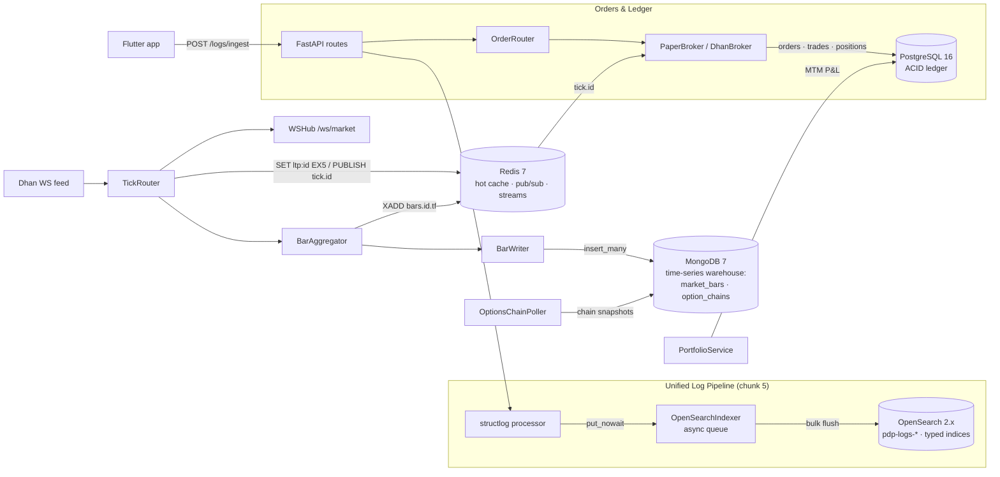

# PDP — Project Profile

## Mission

A self-hosted, **OpenSpec-driven** trading and investment platform covering:

- **Intraday**: algo + manual options/futures trading on NIFTY / BANKNIFTY / SENSEX
- **Positional**: swing F&O and equity positions with Greek/expiry awareness
- **Portfolio**: long-term equity & mutual-fund holdings, real-time P&L, corporate actions

Everything is spec-first: no implementation lands without a proposal under `openspec/changes/`.

## Tech Stack

| Layer            | Choice                                            |
|------------------|---------------------------------------------------|
| Language         | Python 3.13                                       |
| Package mgr      | `uv` (lock + sync)                                |
| Web framework    | FastAPI + uvicorn (uvloop, httptools)             |
| Response models  | `msgspec.Struct` (hot path), `pydantic` (input)   |
| DataFrame engine | Polars                                            |
| DB (transactional) | PostgreSQL 16 (ACID ledger: orders, positions, accounts, instruments) |
| DB (analytics)   | MongoDB 7 (options chains + Greeks as documents; one doc per expiry snapshot) |
| DB (hot/cache)   | Redis 7 (pub/sub + streams + hash)                |
| ORM / migrations | SQLAlchemy 2.0 async + Alembic                    |
| HTTP client      | httpx (async)                                     |
| Logging          | structlog (JSON to stdout + OpenSearch via non-blocking processor) |
| Tests            | pytest + pytest-asyncio                           |
| Lint/format      | ruff                                              |
| Type check       | pyright (strict on `src/pdp/`)                    |
| Task runner      | Taskfile.yml                                      |
| Broker (v1)      | Dhan (paper + live-gated)                         |
| Search/analytics | OpenSearch 2.x (unified log pipeline + realtime analytics dashboards) |
| Frontend (app)   | Flutter (Dart) + Riverpod + fl_chart + web_socket_channel (Android + Windows desktop) |

## Architecture

Two storage tiers with a strict split: **PostgreSQL is the ACID transactional ledger** (orders,
trades, positions, accounts, instruments) and **MongoDB is the time-series warehouse** for all
historical market data (OHLCV bars, option chains, Greeks). **Redis** is the hot path —
LTP cache, tick pub/sub, and bar streams.



## Conventions

- **Paper-first**: orders route to the paper engine unless `LIVE=1` AND broker is wired.
- **Spec-first**: every capability lives under `openspec/specs/<capability>/spec.md` after archival.
- **One mutation per route**: avoid kitchen-sink endpoints.
- **Universal indicators**: levels/indicators/value-areas computed once, consumed by all strategies.
- **DB separation**: PostgreSQL owns the transactional ledger only (orders/trades/positions/accounts/instruments — ACID, structured); MongoDB owns all historical/time-series market data (OHLCV bars + options chains + Greeks; fast sequential scan for backtest).
- **Latency budget**: tick → WebSocket fan-out p99 ≤ 50ms on a single instrument.
- **Settings via env** + `pydantic-settings`; never read `os.environ` directly in app code.
- **Structured logging only**: no bare `print()` or `rich` output inside core modules.

## Glossary

- **Tick** — single market quote from broker WS (LTP, volume, OI).
- **Bar** — time-bucketed OHLCV (1m/5m/15m/30m/1H).
- **Snapshot** — current indicator/level state for `(security_id, timeframe)`.
- **Capability** — a self-contained domain feature backed by one spec folder.
- **Change** — an in-flight proposal under `openspec/changes/<id>/`.

## Layout

```
PDP/
├── openspec/
│   ├── project.md          # this file
│   ├── changes/            # in-flight proposals
│   └── specs/              # archived capabilities (source of truth)
├── backend/                # all Python (run uv / tooling here)
│   ├── pdp/                # package (import as pdp.*): main.py, settings.py, db/,
│   │                       #   market/, orders/, portfolio/, strategy/, signals/, …
│   ├── backtest/           # runnable backtests + configs/*.yaml
│   ├── strategies/         # strategy YAML configs
│   ├── scripts/            # ops scripts (scripts/oneoff/ = run-once)
│   ├── tests/  alembic/  alembic.ini  data/
│   ├── pyproject.toml  uv.lock  .env
│   └── CLAUDE.md           # backend dev index (dev-activity → minimal context)
├── app/                    # Flutter (Dart) client
├── infra/
│   ├── compose/            # docker-compose.yml (project name pinned: pdp)
│   ├── opensearch/         # dashboards-as-code (8 NDJSON saved-object files → task search:init)
│   ├── launchers/  loadtest/  logs/
│   └── terraform/  deploy/  # reserved for cloud-deploy-aws (chunk 16)
├── docs/                   # ARCHITECTURE.md, RUNBOOK.md, feature docs
├── Taskfile.yml            # single entrypoint (dir: backend | infra/compose)
└── CLAUDE.md               # top-level index + program roadmap
```

Run all Python tooling via the root `Taskfile.yml` (which sets `dir: backend`) or `uv run`
from `backend/`. Container tasks run in `infra/compose/`.
